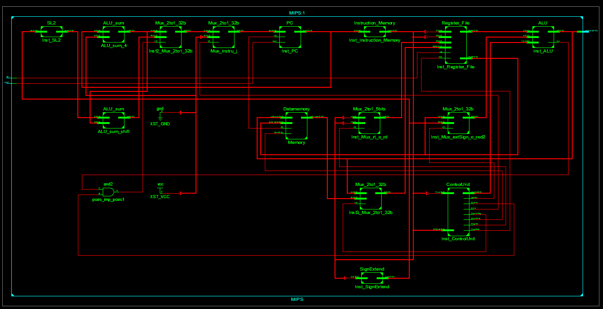

# singleCycle-mips-vhdl

## My team's project in Computer Architecture lecture. We write mips architecture with vhdl and run this instructions

### Software

* [Xilinx ISE Project Navigator][Xilinx] - FPGA design solution to synthesis and simulation
* [MARS] - **M**IPS **A**ssembler and **R**untime **S**imulator

